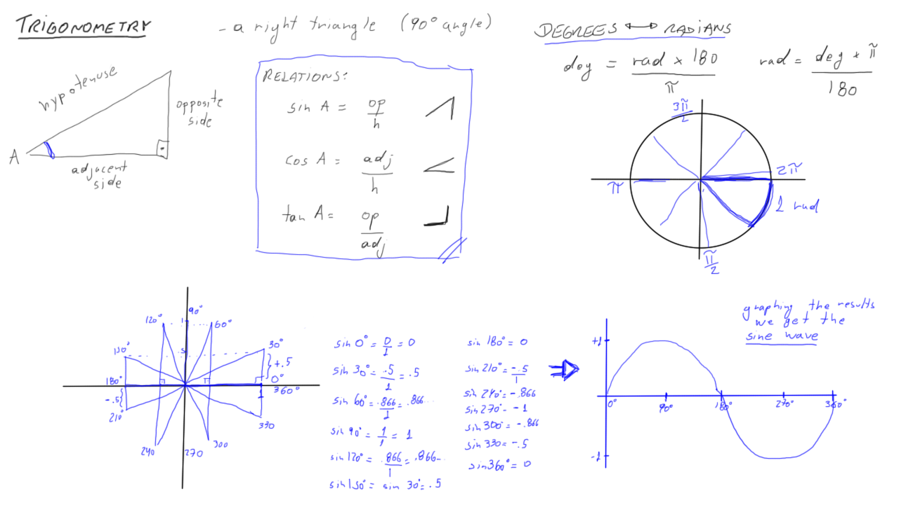

01 Trigonometry
===

- Important concept for graphics, games and animations.
- Important to know how fast things gonna go, the direction of things,
  movements, etc.
- Trigonometry is the study of triangles
- The study of relationship between angles and the sides of the triangle

TODO: Add cos/tan graphics
TODO: Talk about circles, ellipses movements and Lissajous curves

